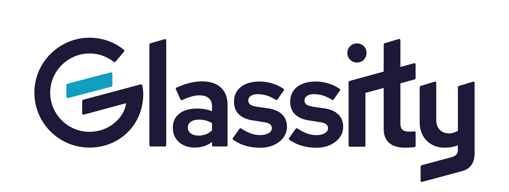

# FOCUS MCP Server

<p align="center">
  <a href="https://glassity.cloud">
    
  </a>
  <br />
  <strong>Get comprehensive cloud cost visibility and optimization insights at <a href="https://glassity.cloud">glassity.cloud</a></strong>
</p>

---

[](https://www.python.org/downloads/)
[](https://focus.finops.org/)
[](https://focus.finops.org/)
[](https://focus.finops.org/)

An educational MCP (Model Context Protocol) server for analyzing FOCUS (FinOps Open Cost & Usage Specification) billing data. This server provides AI assistants with powerful tools to query and analyze cloud cost data using the industry-standard FOCUS format.

## What is FOCUS?

[FOCUS](https://focus.finops.org/) (FinOps Open Cost & Usage Specification) is an open standard for cloud billing data that provides consistent, normalized cost and usage data across cloud providers like AWS, Azure, and Google Cloud. It enables organizations to:

- **Standardize** cost data across multiple cloud providers
- **Simplify** financial analysis and reporting
- **Enable** consistent FinOps practices
- **Improve** cost optimization and allocation

## What This Server Does

This MCP server connects AI assistants (like Claude) to your FOCUS billing data, enabling natural language queries for complex cost analysis. Instead of writing SQL manually, you can ask questions like:

- "What are my highest cost services by region this month?"
- "Show me commitment discount utilization trends"
- "Find anomalous spending patterns by account"

The server provides:

- 🔍 **36+ predefined queries** from the official FOCUS documentation
- 📊 **DuckDB-powered analytics** for fast querying of large datasets
- 🔄 **Multi-version support** (FOCUS v1.0, v1.1, v1.2)
- 📚 **Schema documentation** with column/attribute definitions from FOCUS spec
- 🎯 **Educational examples** with citations to official docs

## Features

### MCP Tools Available

**Data & Query Tools:**

1. **`get_data_info`** - Inspect your loaded FOCUS data (row counts, date ranges, providers)
2. **`list_use_cases`** - Browse 36+ predefined analysis queries
3. **`get_use_case`** - Get detailed info about specific queries (SQL, parameters, citations)
4. **`execute_query`** - Run custom SQL or predefined queries on your data

**Schema & Specification Tools:**

5. **`list_columns`** - List all FOCUS columns with metadata (type, requirement level)
6. **`get_column_details`** - Get detailed information for specific columns
7. **`list_attributes`** - List FOCUS formatting standards and conventions
8. **`get_attribute_details`** - Get detailed requirements for specific attributes

### Query Library

- **36+ Professional Queries (more queries for later versions)**: Curated from [focus.finops.org](https://focus.finops.org/) use cases
- **Version Support**: Queries for FOCUS v1.0, v1.1, and v1.2
- **Real-world Scenarios**: Cost optimization, budget tracking, anomaly detection
- **Official Citations**: Each query links back to the FOCUS documentation

## Quick Start

### 1. Prepare Your FOCUS Data

This server works with FOCUS billing data in Parquet format with Hive partitioning, supporting both local files and S3 storage.

#### Local Data

```bash
# Set your data location for local files
export FOCUS_DATA_LOCATION="/path/to/your/focus/data"

# Expected structure:
# /path/to/your/focus/data/
# ├── billing_period=2025-05/
# │   ├── file1.parquet
# │   └── file2.parquet
# ├── billing_period=2025-06/
# │   └── ...
```

#### S3 Data

```bash
# Set your data location for S3
export FOCUS_DATA_LOCATION="s3://your-bucket/focus-exports"

# Optional: Set AWS region (defaults to us-east-1)
export AWS_REGION="us-west-2"

# Note: Some S3 buckets store files with a leading slash in the path
# In such cases, you may need a double slash after the bucket name:
# export FOCUS_DATA_LOCATION="s3://your-bucket//focus/path"

# Authentication happens automatically via AWS credential chain:
# 1. IAM Role (automatic on EC2/ECS/Lambda)
# 2. Environment variables (AWS_ACCESS_KEY_ID, AWS_SECRET_ACCESS_KEY)
# 3. AWS Profile (set AWS_PROFILE env var to use a specific profile)
# 4. ~/.aws/credentials file

# Example: Use a specific AWS profile
export AWS_PROFILE="billing-reader"
```

**Getting FOCUS Data:**

- **AWS**: Follow the [official FOCUS setup guide for AWS](https://focus.finops.org/get-started/aws/)
- **Microsoft Azure**: Follow the [official FOCUS setup guide for Microsoft](https://focus.finops.org/get-started/microsoft/)
- **Google Cloud**: Follow the [official FOCUS setup guide for Google Cloud](https://focus.finops.org/get-started/google-cloud/)
- **Other Providers**: See [all FOCUS setup guides](https://focus.finops.org/get-started/)

### 2. Install & Configure with Docker (Recommended)

The server is available as a Docker image on both Docker Hub and GitHub Container Registry.

#### Pull the Docker Image

```bash
# From Docker Hub (recommended)
docker pull glassity/focus-mcp:latest

# Or from GitHub Container Registry
docker pull ghcr.io/glassity/focus-mcp:latest

# Or use a specific version
docker pull glassity/focus-mcp:v0.1.1
```

#### Configure Claude Desktop

Add to your Claude Desktop `claude_desktop_config.json`:

**For local FOCUS data:**

```json
{
  "mcpServers": {
    "focus": {
      "command": "docker",
      "args": [
        "run",
        "-i",
        "--rm",
        "-v",
        "/path/to/your/focus/data:/data:ro",
        "-e",
        "FOCUS_DATA_LOCATION=/data",
        "-e",
        "FOCUS_VERSION=1.0",
        "glassity/focus-mcp:latest"
      ]
    }
  }
}
```

**For S3 data with AWS credentials:**

```json
{
  "mcpServers": {
    "focus": {
      "command": "docker",
      "args": [
        "run",
        "-i",
        "--rm",
        "-e", "FOCUS_DATA_LOCATION=s3://your-bucket/focus-exports",
        "-e", "AWS_REGION=us-west-2",
        "-e", "AWS_ACCESS_KEY_ID=your-access-key",
        "-e", "AWS_SECRET_ACCESS_KEY=your-secret-key",
        "glassity/focus-mcp:latest"
      ]
    }
  }
}
```

**For S3 data with AWS profile:**

```json
{
  "mcpServers": {
    "focus": {
      "command": "docker",
      "args": [
        "run",
        "-i",
        "--rm",
        "-v", "/Users/YOUR_USERNAME/.aws:/home/mcp/.aws:ro",
        "-e", "FOCUS_DATA_LOCATION=s3://your-bucket/focus-exports",
        "-e", "AWS_REGION=us-west-2",
        "-e", "AWS_PROFILE=billing-reader",
        "glassity/focus-mcp:latest"
      ]
    }
  }
}
```

### 3. Test the Connection

Start Claude Desktop and try:

```
Can you show me information about my FOCUS data?
```

Claude will use the `get_data_info` tool to inspect your dataset.

### 4. Usage Examples

```
# Inspect your data
"Show me what FOCUS data is loaded"

# Use a predefined query
"Run the service costs by region analysis for the last 3 months"

# Custom SQL analysis
"Show me the top 10 most expensive services across all accounts"

# Parameter-based queries
"Analyze commitment discount utilization for 2025-08-01 to 2025-09-01"

# Anomaly detection
"Find accounts with unusual spending patterns this month"

# Cost optimization
"Show me unused capacity reservations that I can optimize"

# Multi-provider analysis
"Compare costs across different cloud providers and regions"

# Schema exploration
"What columns are available in FOCUS v1.2?"
"Explain the difference between BilledCost and EffectiveCost"
```

## Configuration

### Environment Variables

| Variable              | Default             | Description                                           |
| --------------------- | ------------------- | ----------------------------------------------------- |
| `FOCUS_DATA_LOCATION` | `data/focus-export` | Path to FOCUS data (local or S3 URI)                  |
| `FOCUS_VERSION`       | `1.0`               | FOCUS specification version (1.0, 1.1, 1.2)           |
| `AWS_REGION`          | `us-east-1`         | AWS region for S3 access                              |
| `AWS_PROFILE`         | (optional)          | AWS profile name to use for S3 authentication         |

### S3 Configuration Example

```json
{
  "mcpServers": {
    "focus": {
      "command": "uv",
      "args": ["run", "--directory", "/path/to/focus-mcp", "python", "focus_mcp_server.py"],
      "env": {
        "FOCUS_DATA_LOCATION": "s3://my-billing-bucket/focus-exports",
        "AWS_REGION": "us-west-2",
        "AWS_PROFILE": "billing-reader"
      }
    }
  }
}
```

The AWS credential chain automatically finds credentials from:
- IAM roles (when running on AWS infrastructure)
- Environment variables (AWS_ACCESS_KEY_ID, AWS_SECRET_ACCESS_KEY)
- AWS CLI profiles (set AWS_PROFILE env var to specify which profile)
- AWS credentials file (~/.aws/credentials)

Note: AWS_PROFILE is a standard AWS environment variable that the credential chain respects.

## Development

For developers who want to contribute or customize the server:

### Installation from Source

```bash
# Clone the repository
git clone https://github.com/glassity/focus-mcp.git
cd focus-mcp

# Install with uv (recommended)
uv sync

# Or install with pip
pip install -e .

# Install with dev dependencies for development
uv sync --extra dev
```

### Running Locally with uv

```bash
# Set your data location
export FOCUS_DATA_LOCATION="data/focus-export"

# Run the server
uv run python focus_mcp_server.py
```

### Configure Claude Desktop with Local Installation

Add to your Claude Desktop `claude_desktop_config.json`:

```json
{
  "mcpServers": {
    "focus": {
      "command": "uv",
      "args": [
        "run",
        "--directory",
        "/path/to/focus-mcp",
        "python",
        "focus_mcp_server.py"
      ],
      "env": {
        "FOCUS_DATA_LOCATION": "/path/to/your/focus/data",
        "FOCUS_VERSION": "1.0"
      }
    }
  }
}
```

### Building Your Own Docker Image

```bash
# Build the image
docker build -t focus-mcp:custom .

# Run your custom image
docker run -i --rm \
  -v "/path/to/your/focus/data:/data:ro" \
  -e FOCUS_DATA_LOCATION=/data \
  focus-mcp:custom
```

### Running Docker Directly (for testing)

#### Local FOCUS Data

```bash
docker run -i --rm \
  -v "/path/to/your/focus/data:/data:ro" \
  -e FOCUS_DATA_LOCATION=/data \
  -e FOCUS_VERSION=1.0 \
  glassity/focus-mcp:latest
```

#### S3 FOCUS Data

**Using AWS credentials from environment:**

```bash
docker run -i --rm \
  -e FOCUS_DATA_LOCATION="s3://your-bucket/focus-exports" \
  -e AWS_REGION="us-west-2" \
  -e AWS_ACCESS_KEY_ID="your-access-key" \
  -e AWS_SECRET_ACCESS_KEY="your-secret-key" \
  glassity/focus-mcp:latest
```

**Using AWS profile:**

```bash
docker run -i --rm \
  -v "$HOME/.aws:/home/mcp/.aws:ro" \
  -e FOCUS_DATA_LOCATION="s3://your-bucket/focus-exports" \
  -e AWS_REGION="us-west-2" \
  -e AWS_PROFILE="billing-reader" \
  glassity/focus-mcp:latest
```

## Todo

- [ ] Implement automated query synchronization from FOCUS specification
- [x] Extract column definitions and attributes from FOCUS spec for enhanced data insights
- [ ] Enhance response formatting with citations and educational context for AI models
- [ ] Validate all use cases queries against v1.1 and v1.2 exports
- [ ] Evaluate if moving attributes/columns to MCP resources makes more sense
- [ ] Review conformance gap documents for additional documentation and insights to share in the responses
